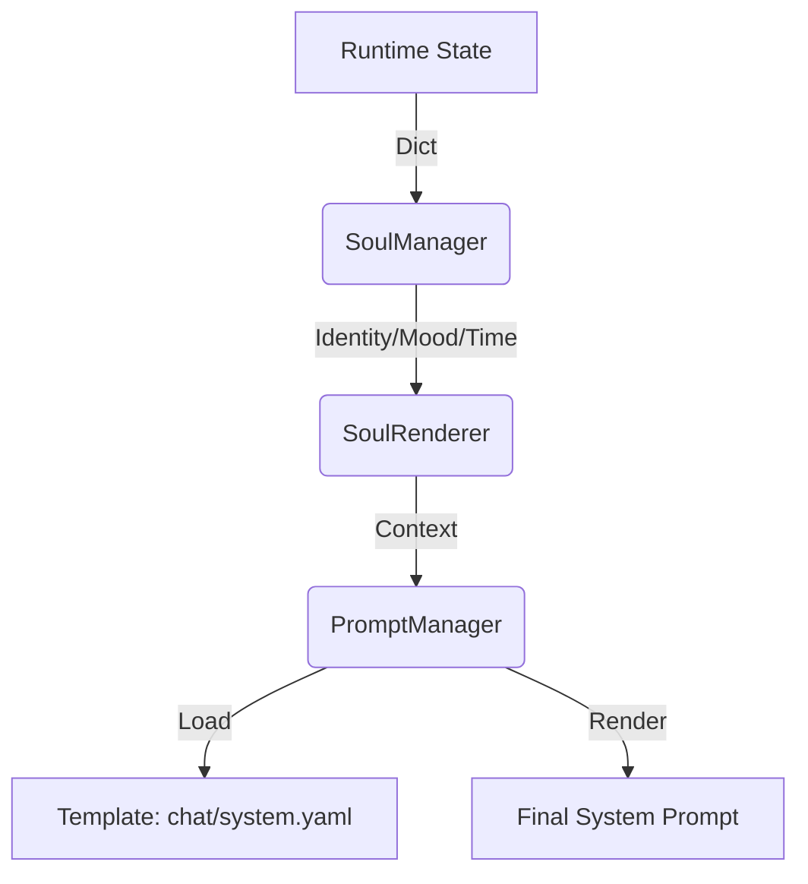

# Lumina Technical Reference Manual

> **Note**: This document is the "Deep Dive" source of truth for implementation details. It complements the `FEATURE_INVENTORY.md` (Architecture Overview).

---

## 1. Prompt Engineering System

Lumina uses a **Dynamic, Template-Driven** prompt system. We do not hardcode giant prompt strings in Python. Instead, we use `Jinja2` templates managed by `PromptManager`.

### 1.1 Architecture



### 1.2 Core Components

#### `PromptManager` (`python_backend/prompt_manager.py`)

- **Role**: Logic-less template engine.
- **Path**: Loads from `python_backend/prompts/`.
- **Format**: Supports `.yaml` (Structured) and `.jinja2` (Text).
- **Caching**: Templates are cached in memory for performance.

#### `SoulRenderer` (`services/soul/renderer.py`)

- **Role**: Pure function that transforms Raw State (Numbers, JSON) into Template Context (Strings).
- **Key Methods**:
  - `render()`: Generates the Base Persona (Static System Prompt).
  - `render_dynamic_context()`: Generates Real-Time context (Time, Mood, Energy).

### 1.3 Template Structure

We use a structured YAML approach (`prompts/chat/system.yaml`) to enforce strict instruction following.

```yaml
# Conceptual Structure of chat/system.yaml
role: |
  Name: {{ char_name }}
  Description: {{ description }}
  Personality Traits: {{ traits | join(', ') }}

style: |
  - Be concise.
  - Use emotive language appropriate for {{ mood }}.

constraints: |
  - NEVER output {{ forbidden_words }}.
  - Output format: JSON.
```

### 1.4 Dynamic Injection Logic

The final System Prompt is composed of layers provided by different modules via the `ContextProvider` interface.

1.  **Core Layer** (`SoulContextProvider`): Identity, Static Personality, Environment.
2.  **Plugin Layer** (e.g., `GalgameContextProvider`): Game State (Energy, Relationship).
3.  **Memory Layer** (`RAGContextProvider`): Retrieval.

This architecture ensures that `SoulManager` remains pure and core, while plugins like `Galgame` inject their specific logic dynamically.

### 1.5 Example: Soul State to Prompt

If `SoulManager` state is:

```json
{
  "mood_value": 0.8,
  "energy_level": 30
}
```

`SoulRenderer` transforms this to:

```python
context = {
  "mood_desc": "Elated",
  "energy_instruction": "You are tired. Speak in short, sleepy sentences."
}
```

The Template renders:

> "You are Elated. You are tired. Speak in short, sleepy sentences."

---

## 2. Memory System Internals

### 2.1 Storage Schema (SurrealDB)

We use a Graph-Vector hybrid model in SurrealDB.

- **Nodes**: `memory`, `entity`, `concept`.
- **Edges**: `relates_to`, `occured_at`.

#### `memory` Table

| Field        | Type         | Description                                   |
| :----------- | :----------- | :-------------------------------------------- |
| `content`    | string       | The text content.                             |
| `embedding`  | array<float> | 384-dim vector (all-MiniLM-L6-v2).            |
| `created_at` | datetime     | ISO 8601 timestamp.                           |
| `tags`       | list<string> | auto-generated tags.                          |
| `importance` | float        | 0.0 - 1.0 (Calculated via Recency/Relevance). |

### 2.2 The "Consolidation" Process

Memory isn't just storage; it's active.

1.  **Ingestion**: Chat text -> Vectorized -> Stored as Short-Term Memory.
2.  **Digestion** (Background Job):
    - `ConsolidationBatch` runs every X minutes.
    - Clusters recent memories.
    - Generates summary (LLM).
    - Writes to Long-Term Memory (Graph).
3.  **Refusal**: Use `NoOpDriver` if DB is offline, ensuring the bot can still talk (amnesiac mode).

---

## 3. Plugin Architecture (V2)

### 3.1 Isolation Modes

Plugins define their isolation execution model in `manifest.yaml`:

- `isolation_mode: local`: Runs in Main process (Fast, but risky).
- `isolation_mode: process`: Runs in `multiprocessing.Process` (Safe, IPC overhead).

### 3.2 The Proxy Pattern

When `SystemPluginManager` loads an isolated plugin:

1.  It creates a `RemotePluginProxy` instance.
2.  Passes the `manifest` path.
3.  Spawns a child process invoking `services/plugin_worker.py`.
4.  Establishes `multiprocessing.Queue` for Command/Event loop.

**Flow**:
`Main` -> `Proxy.execute()` -> `Queue (CMD)` -> `Worker` -> `ActualPlugin.execute()` -> `Queue (EVENT)` -> `Main`

---

_To be continued: Audio Pipeline Details, Live2D Protocol..._
